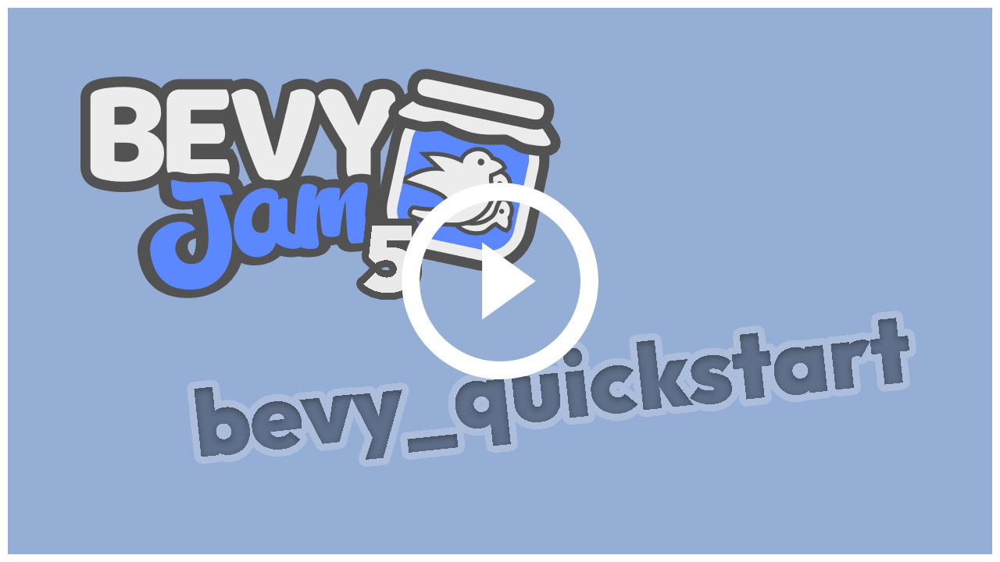
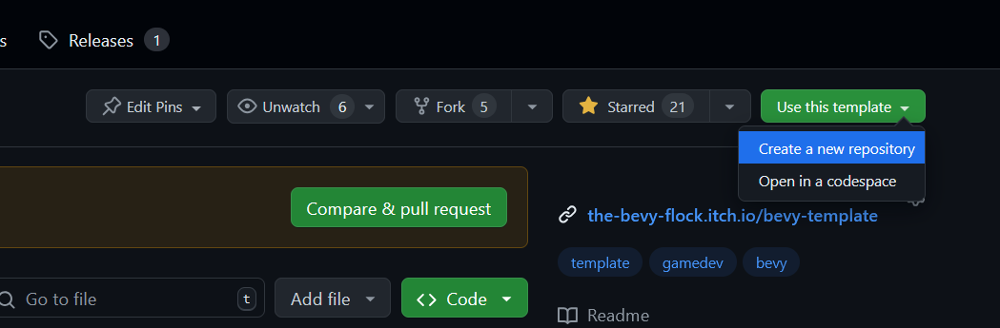

_Brought to you by the Bevy Jam working group._

# Bevy Quickstart

This template is a great way to get started on a new [Bevy](https://bevyengine.org/) game—especially for a game jam!
Start with a [basic project structure](#write-your-game) and [CI / CD](#release-your-game) that can deploy to [itch.io](https://itch.io).
You can [try this template in your web browser!](https://the-bevy-flock.itch.io/bevy-quickstart)

Don't want to read through the whole README? [@ChristopherBiscardi](https://github.com/ChristopherBiscardi) made a video on how to use the template from start to finish:

[](https://www.youtube.com/watch?v=ESBRyXClaYc)

## Prerequisites

We assume that you know how to use Bevy already and have seen the [official Quick Start Guide](https://bevyengine.org/learn/quick-start/introduction/).

If you're new to Bevy, the patterns used in this template may look a bit weird at first glance.
See our [Design Document](./docs/design.md) for more information on how we structured the code and why.

## Create a new game

Install [`cargo-generate`](https://github.com/cargo-generate/cargo-generate) and run the following commands:

```sh
cargo generate TheBevyFlock/bevy_quickstart --branch cargo-generate
git branch --move main
```

Then [create a GitHub repository](https://github.com/new) and push your local repository to it.

<details>
  <summary>This template can also be set up manually.</summary>

Navigate to the top of [this GitHub repository](https://github.com/TheBevyFlock/bevy_quickstart/) and select `Use this template > Create a new repository`:



Clone your new Github repository to a local repository and push a commit with the following changes:

- Delete `LICENSE`, `README`, and `docs/` files.
- Search for and replace instances of `bevy_quickstart` with the name of your project.
- Adjust the `env` variables in [`.github/workflows/release.yaml`](./.github/workflows/release.yaml).

</details>

## Write your game

The best way to get started is to play around with what you find in [`src/demo/`](./src/demo).

This template comes with a basic project structure that you may find useful:

| Path                                               | Description                                                        |
| -------------------------------------------------- | ------------------------------------------------------------------ |
| [`src/lib.rs`](./src/lib.rs)                       | App setup                                                          |
| [`src/asset_tracking.rs`](./src/asset_tracking.rs) | A high-level way to load collections of asset handles as resources |
| [`src/audio/`](./src/audio)                        | Marker components for sound effects and music                      |
| [`src/demo/`](./src/demo)                          | Example game mechanics & content (replace with your own code)      |
| [`src/dev_tools.rs`](./src/dev_tools.rs)           | Dev tools for dev builds (press \` aka backtick to toggle)         |
| [`src/screens/`](./src/screens)                    | Splash screen, title screen, gameplay screen, etc.                 |
| [`src/theme/`](./src/theme)                        | Reusable UI widgets & theming                                      |

Feel free to move things around however you want, though.

> [!Tip]
> Be sure to check out the [3rd-party tools](./docs/tooling.md) we recommend!

## Run your game

Running your game locally is very simple:

- Use `cargo run` to run a native dev build.
- Use [`trunk serve`](https://trunkrs.dev/) to run a web dev build.

If you're using [VS Code](https://code.visualstudio.com/), this template comes with a [`.vscode/tasks.json`](./.vscode/tasks.json) file.

<details>
  <summary>Run release builds</summary>

- Use `cargo run --profile release-native --no-default-features` to run a native release build.
- Use `trunk serve --release --no-default-features` to run a web release build.

</details>

<details>
  <summary>Linux dependencies</summary>

If you are using Linux, make sure you take a look at Bevy's [Linux dependencies](https://github.com/bevyengine/bevy/blob/main/docs/linux_dependencies.md).
Note that this template enables Wayland support, which requires additional dependencies as detailed in the link above.
Wayland is activated by using the `bevy/wayland` feature in the [`Cargo.toml`](./Cargo.toml).

</details>

<details>
    <summary>(Optional) Improve your compile times</summary>

[`.cargo/config_fast_builds.toml`](./.cargo/config_fast_builds.toml) contains documentation on how to set up your environment to improve compile times.
After you've fiddled with it, rename it to `.cargo/config.toml` to enable it.

</details>

## Release your game

This template uses [GitHub workflows](https://docs.github.com/en/actions/using-workflows) to run tests and build releases.
See [Workflows](./docs/workflows.md) for more information.

## Known Issues

There are some known issues in Bevy that require some arcane workarounds.
To keep this template simple, we have opted not to include those workarounds.
You can read about them in the [Known Issues](./docs/known-issues.md) document.

## License

The source code in this repository is licensed under any of the following at your option:

- [CC0-1.0 License](./LICENSE-CC0-1.0.txt)
- [MIT License](./LICENSE-MIT.txt)
- [Apache License, Version 2.0](./LICENSE-Apache-2.0.txt)

The CC0 license explicitly does not waive patent rights, but we confirm that we hold no patent rights to anything presented in this repository.

## Credits

The [assets](./assets) in this repository are all 3rd-party. See the [credits screen](./src/screens/credits.rs) for more information.
