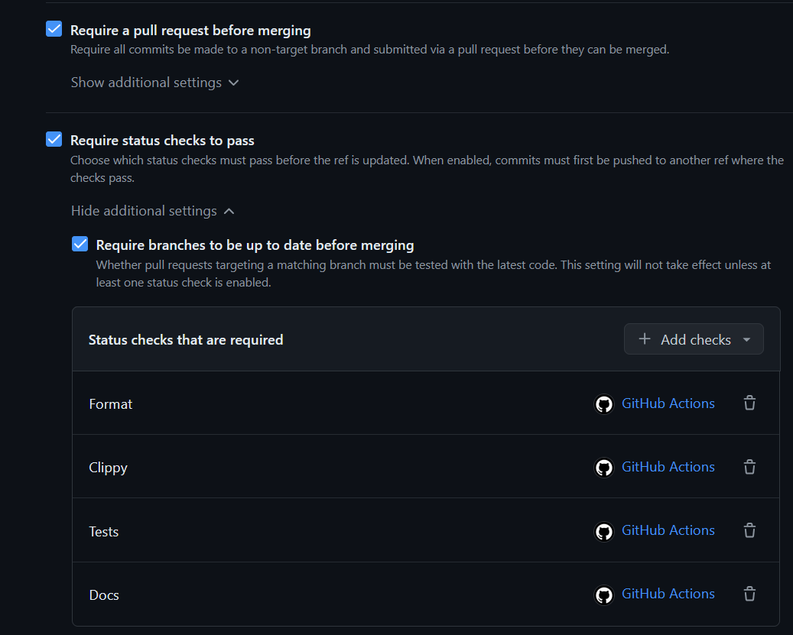
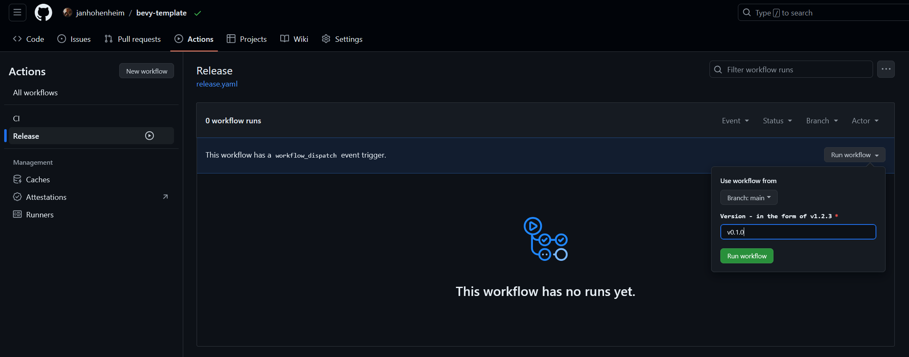
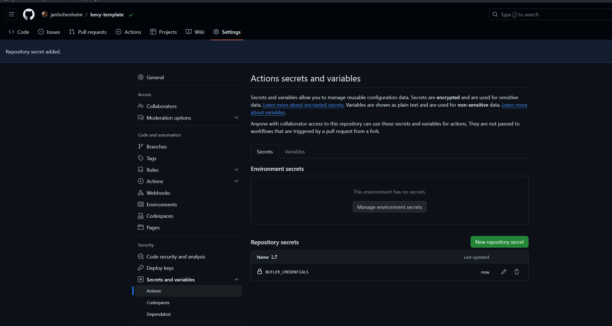
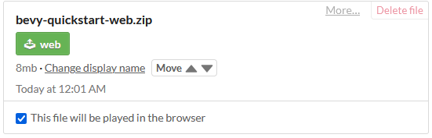

# Workflows

This template uses [GitHub workflows](https://docs.github.com/en/actions/using-workflows) for [CI / CD](https://www.redhat.com/en/topics/devops/what-is-ci-cd), defined in [`.github/workflows/`](../.github/workflows).

## CI (testing)

The [CI workflow](.github/workflows/ci.yaml) will trigger on every commit or PR to `main`, and do the following:

- Run tests.
- Run Clippy lints.
- Check formatting.
- Check documentation.

> [!Tip]
> <details>
>   <summary>You may want to set up a <a href="https://docs.github.com/en/repositories/configuring-branches-and-merges-in-your-repository/managing-rulesets/about-rulesets">GitHub ruleset</a> to require that all commits to <code>main</code> pass CI.</summary>
>
>   
> </details>

## CD (releasing)

The [CD workflow](../.github/workflows/release.yaml) will trigger on every pushed tag in the format `v1.2.3`, and do the following:

- Create a release build for Windows, macOS, Linux, and web.
- (Optional) Upload to [GitHub releases](https://docs.github.com/en/repositories/releasing-projects-on-github).
- (Optional) Upload to [itch.io](https://itch.io).

<details>
  <summary>This workflow can also be triggered manually.</summary>

  In your GitHub repository, navigate to `Actions > Release > Run workflow`:

  

  Enter a version number in the format `v1.2.3`, then hit the green `Run workflow` button.
</details>

> [!Important]
> Using this workflow requires some setup. We will go through this now.

### Configure environment variables

The release workflow can be configured by tweaking the environment variables in [`.github/workflows/release.yaml`](../.github/workflows/release.yaml).

<details>
  <summary>Click here for a list of variables and how they're used.</summary>

  ```yaml
  # The base filename of the binary produced by `cargo build`.
  cargo_build_binary_name: bevy_quickstart

  # The path to the assets directory.
  assets_path: assets

  # Whether to upload the packages produced by this workflow to a GitHub release.
  upload_to_github: true

  # The itch.io project to upload to in the format `user-name/project-name`.
  # There will be no upload to itch.io if this is commented out.
  upload_to_itch: the-bevy-flock/bevy-quickstart

  ############
  # ADVANCED #
  ############

  # The ID of the app produced by this workflow.
  # Applies to macOS releases.
  # Must contain only A-Z, a-z, 0-9, hyphens, and periods: https://developer.apple.com/documentation/bundleresources/information_property_list/cfbundleidentifier
  app_id: the-bevy-flock.bevy-quickstart

  # The base filename of the binary in the package produced by this workflow.
  # Applies to Windows, macOS, and Linux releases.
  # Defaults to `cargo_build_binary_name` if commented out.
  app_binary_name: bevy_quickstart

  # The name of the `.zip` or `.dmg` file produced by this workflow.
  # Defaults to `app_binary_name` if commented out.
  app_package_name: bevy_quickstart

  # The display name of the app produced by this workflow.
  # Applies to macOS releases.
  # Defaults to `app_package_name` if commented out.
  app_display_name: Bevy Quickstart

  # The short display name of the app produced by this workflow.
  # Applies to macOS releases.
  # Must be 15 or fewer characters: https://developer.apple.com/documentation/bundleresources/information_property_list/cfbundlename
  # Defaults to `app_display_name` if commented out.
  app_short_name: Bevy Quickstart

  # Before enabling LFS, please take a look at GitHub's documentation for costs and quota limits:
  # https://docs.github.com/en/repositories/working-with-files/managing-large-files/about-storage-and-bandwidth-usage
  git_lfs: false
  ```
</details>

The values are set automatically by `cargo generate`, or you can edit them yourself and push a commit.

### Set up itch.io upload

#### Add butler credentials

<details>
  <summary>In your GitHub repository, navigate to <code>Settings > Secrets and variables > Actions</code>.</summary>

  
</details>

Hit `New repository secret` and enter the following values, then hit `Add secret`:

- **Name:** `BUTLER_CREDENTIALS`
- **Secret:** Your [itch.io API key](https://itch.io/user/settings/api-keys) (create a new one if necessary)

#### Create itch.io project

Create a new itch.io project with the same user and project name as in the `upload_to_itch` variable in [`.github/workflows/release.yaml`](../.github/workflows/release.yaml).
Hit `Save & view page` at the bottom of the page.

[Trigger the release workflow](#cd-releasing) for the first time. Once it's done, go back to itch.io and hit `Edit game` in the top left.

Set `Kind of project` to `HTML`, then find the newly uploaded `web` build and tick the box that says "This file will be played in the browser".


